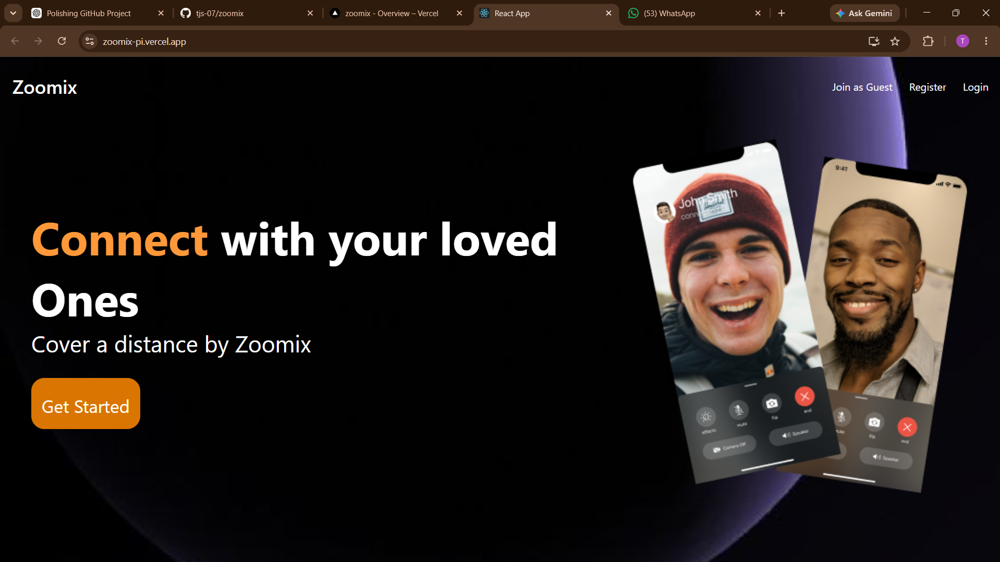
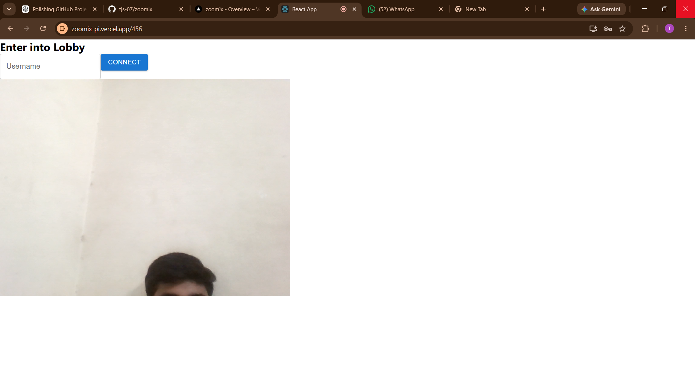

# 🎥 Zoomix

A full-stack video conferencing web application that enables users to create and join meetings with a modern, responsive interface.

## 🌐 Live Demo

🚀 **Frontend:** https://zoomix-p7br47a3x-tejas-projects-355e11f3.vercel.app/

## 🚀 Features

- User Authentication
- Create and Join Video Meetings
- Real-time Communication
- Responsive Mobile Design
- Modern Landing Page
- Cross-device Compatibility

## 🛠️ Tech Stack

### Frontend
- React.js
- Vite
- CSS

### Backend
- Node.js
- Express.js

### Database
- MongoDB

### Technologies Used
- WebRTC
- Socket.IO

## 📸 Screenshots

### Home Page



### Meeting Room



### Mobile View


## 📂 Project Structure

```text
Zoomix/
├── frontend/
├── backend/
└── README.md
